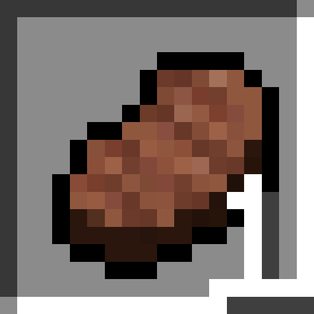

# No Food Stack

A dead-simple mod to revert the new food-stacking mechanics of BTA 7.2.

All food items stack to 1, except for the following exceptions, which already stacked in 7.1 / B1.7.3:

- Raw / Cooked Fish: Stacks to 4
- Cookie: Stacks to 8
- Cherry: Stacks to 2

Combine with `/gamerule instantHealing true` for best experience ;)

[Modrinth](https://modrinth.com/mod/bta-no-food-stack)

Made with :heart: by [Aurailus](https://aurailus.com)
