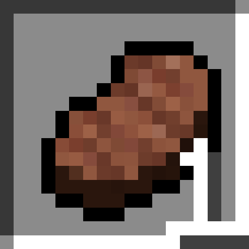

# No Food Stack

A dead-simple mod to revert the new food-stacking mechanics of BTA 7.2.

All food items stack to 1, except for the following exceptions, which already stacked in 7.1 / B1.7.3:

- Raw / Cooked Fish: Stacks to 4
- Cookie: Stacks to 8
- Cherry: Stacks to 2

Combine with `/gamerule instantHealing true` for best experience ;)

## Building (Command Line)

1. Install Temurin JDK 17
2. `./gradlew build`
3. Distribute the generated JAR file in `./build/lib`.

## Downloads

[Modrinth](https://modrinth.com/mod/bta-no-food-stack) • [Releases](https://github.com/Aurailus/bta-no-food-stack/releases)

Made with :heart: by [Aurailus](https://aurailus.com)
